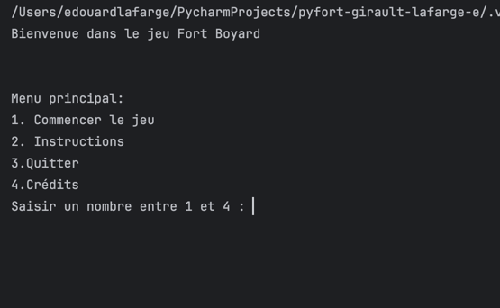
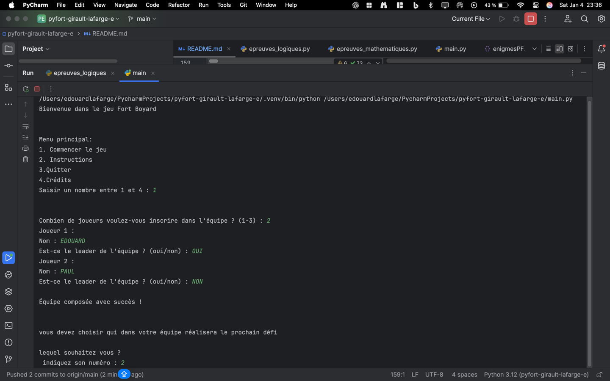
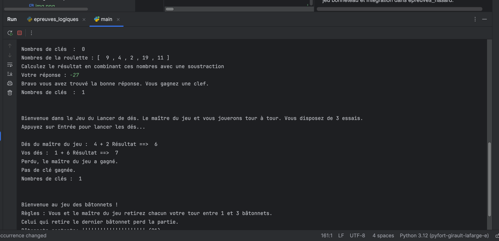
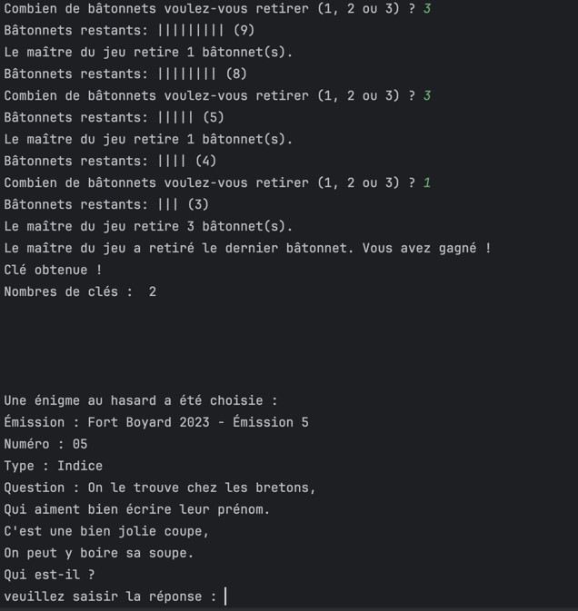

Readme

Fort Boyard Simulator

1. Présentation Générale

Titre du Projet 

Fort Boyard Simulator

Contributeurs
	•	Nom 1 : LAFARGE Edouard
	•	Nom 2 : GIRAULT Paul

Description
https://github.com/tunaryyod91/pyfort-girault-lafarge-e
Ce projet est un simulateur inspiré du célèbre jeu télévisé Fort Boyard. Les joueurs doivent relever des défis pour obtenir des clés, débloquer la salle du trésor, et aussi trouver le mot-code pour remporter la partie.

Fonctionnalités Principales
	•	Création d’une équipe de joueurs.
	•	Épreuves variées :
	•	Mathématiques (calculs, équations, etc.)
	•	Hasard (jeux comme le bonneteau, lancer de dés)
	•	Logique (morpion, bâtonnets)
	•	Énigmes du Père Fouras à partir d’une base de données (JSON).
	•	Épreuve finale pour accéder à la salle du trésor.

Technologies Utilisées
	•	Langage : Python
	•	Bibliothèques : random, json
	•	Outils : Git, PyCharm, Github

Installation

Cloner le dépôt avec Pycharm

Configurer l’environnement en 3.12
Utilisation : Pour exécuter notre application vous devez tout simplement ouvrir l’entierté des fichiers avec le dossier DATA puis d’exécuter le main.py directement. Ensuite laissez vous guider dans le jeu !

2. Documentation Technique

Algorithme du jeu
	1.	Initialisation : Créer une équipe et choisir les épreuves.
	2.	Boucle principale : Les joueurs alternent pour relever les défis.
	3.	Épreuve finale : Résoudre le mot-code pour accéder à la salle du trésor.

Détails des fonctions implémentées
	•Fonctions générales
	1.	main_menu()
	2.	start()
	3.	introduction()
	4.	composer_equipe()
	5.	choix_equipe()
	6.	menu_epreuves()
	7.	choisir_joueur(equipe)

Fonctions liées aux épreuves

Mathématiques
	8.	epreuves_maths()
	9.	epreuve_math_factorielle()
	10.	epreuve_roulette_mathematique()
	11.	resoudre_equation_lineaire()
	12.	epreuve_equation_lineaire()

Logiques
	13.	epreuves_logiques()
	14.	jeu_tictactoe()
	15.	afficher_grille(grille)
	16.	verifier_victoire(grille, symbole)
	17.	coup_maitre(grille, symbole)
	18.	tour_joueur(grille)
	19.	tour_maitre(grille)
	20.	grille_complete(grille)
	21.	verifier_resultat(grille)
	22.	jeu_batonnets()
	23.	affiche_batonnets(n)
	24.	joueur_retrait(n)
	25.	maitre_retrait(n)

Hasard
	26.	epreuves_hasard()
	27.	jeu_lancer_des()
	28.	bonneteau()

Enigmes
	29.	enigmePF()

Fonctions liées à la salle du trésor
	30.	salle_De_Tresor()

Fonctions utilitaires
	31.	factorielle(n)

Gestion des Entrées et Erreurs
	•	Vérification des saisies utilisateur (par exemple, limites des choix pour les bâtonnets ou coordonnées pour le morpion).
	•	Messages clairs en cas d’erreurs.
	•	Liste des bugs connus : Aucun à signaler pour l’instant car ils ont étés tous corrigés.

3. Journal de Bord

Chronologie du Projet
Nous avons commencé par créer les épreuves de mathématiques, de logique ainsi que de hasard. Nous avons ensuite continué par créer la composition des équipes, puis nous avons enchaîné avec la création des clés, nous avons rédigé ensuite le menu établi des règles, ainsi que créer les fonctions utiles. Nous sommes aperçus qu’il y avait quelques problèmes avec le code, notamment des problèmes liés aux clés ainsi que liés aux épreuves elles-mêmes qui ne marchaient pas. Nous avons ensuite créé l’épreuve du père Fouras, ainsi que l’épreuve avec le mot code tout au long du projet. Nous avons essayé de déterminer si il n’y avait pas de bugs pour tester notre code, nous avons à chaque fois testé en brut, c’est-à-dire avec des valeurs réelles directement sur le code lui-même. Nous n’avons pas créé de fonction pour le debug 
.

	•	21/12/2024 : Dépôt intermédiaire sur Moodle.
	•	05/01/2025 : Dépôt final sur Moodle.
	•	06/01/2025 : Soutenance.

Répartition des tâches pour le projet Fort Boyard

 Nous avons souvent travaillé ensemble sur les mêmes parties pour nous entraider, échanger des idées et résoudre les problèmes rapidement. Voici une répartition des tâches basée sur nos contributions respectives :

1. Structure du projet et organisation
	•	Paul : Création de la structure initiale du projet, organisation des fichiers, et gestion des imports.
	•	Édouard : Mise en place du fichier principal et des menus (main_menu et start), ainsi que des instructions pour le jeu.

2. Épreuves

Épreuves Mathématiques
	•	Paul : Développement des fonctions epreuve_math_factorielle et resoudre_equation_lineaire, avec gestion des entrées utilisateur.
	•	Édouard : Implémentation de epreuve_roulette_mathematique et intégration des épreuves mathématiques dans epreuves_maths.

Épreuves Logiques
	•	Paul : Création des jeux jeu_tictactoe et jeu_batonnets, y compris les vérifications de victoire et les algorithmes de jeu.
	•	Édouard : Mise en place des fonctions utilitaires (afficher_grille, verifier_victoire, etc.) et intégration dans epreuves_logiques.

Épreuves Hasard
	•	Paul : Écriture des fonctions jeu_lancer_des et gestion des conditions de victoire.
	•	Édouard : Développement du jeu bonneteau et intégration dans epreuves_hasard.

Énigmes
	•	Travail commun : Nous avons travaillé sur la fonction enigmePF, et  charger les données JSON et gérer les essais des joueurs.

3. Salle du trésor
	•	Travail commun : La fonction salle_De_Tresor a été développée ensemble

4. Interface utilisateur
	•	Paul : Conception des menus principaux et des instructions.
	•	Édouard : Gestion des choix des joueurs et des messages de feedback (ex. “Clé obtenue !”, “Perdu !”).

5. Tests et validation
	•	Travail commun : Nous avons testé chaque épreuve et fonctionnalité ensemble, identifié les bugs, et apporté les corrections nécessaires.

4. Tests et Validation

Stratégies de Test
	•	Tests unitaires pour chaque fonction principale.
	•	Vérification des cas limites (par exemple, saisies incorrectes). Nous sommes aussi aperçu lors des tests d’autres bugs d’erreur sémantique.

Résultats
	•	Tous les tests ont été validés avec succès.
Menu principal :

composition equipes : 

Epreuves : 

